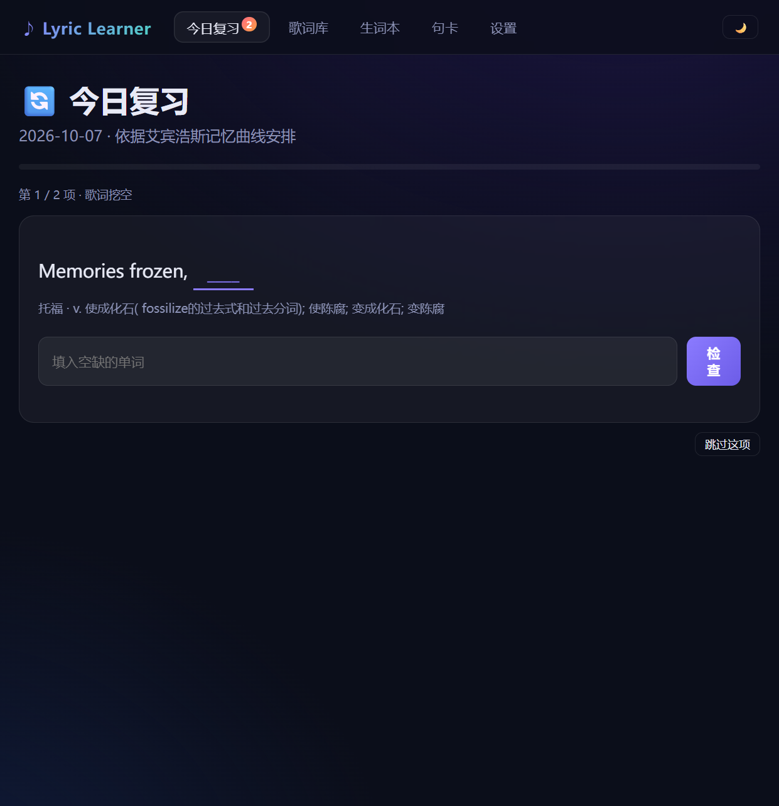
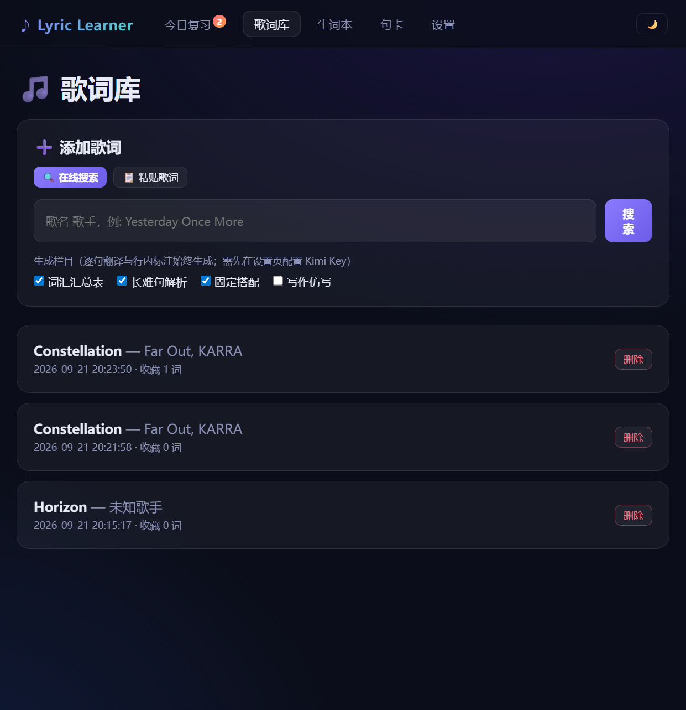
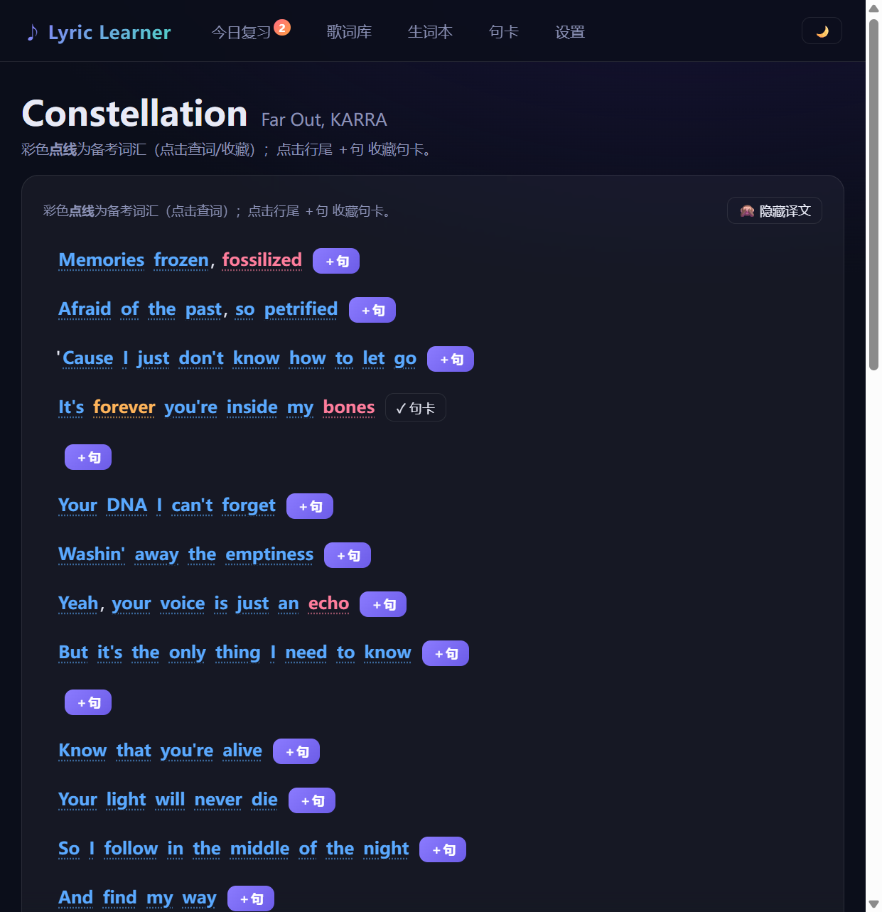
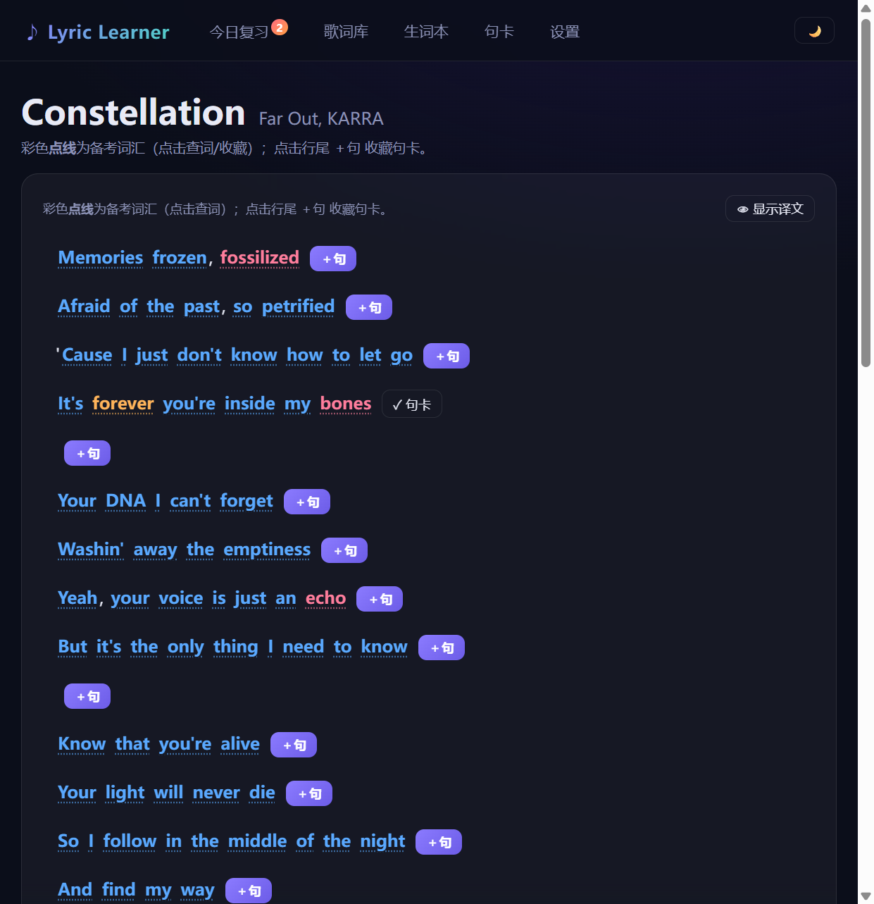
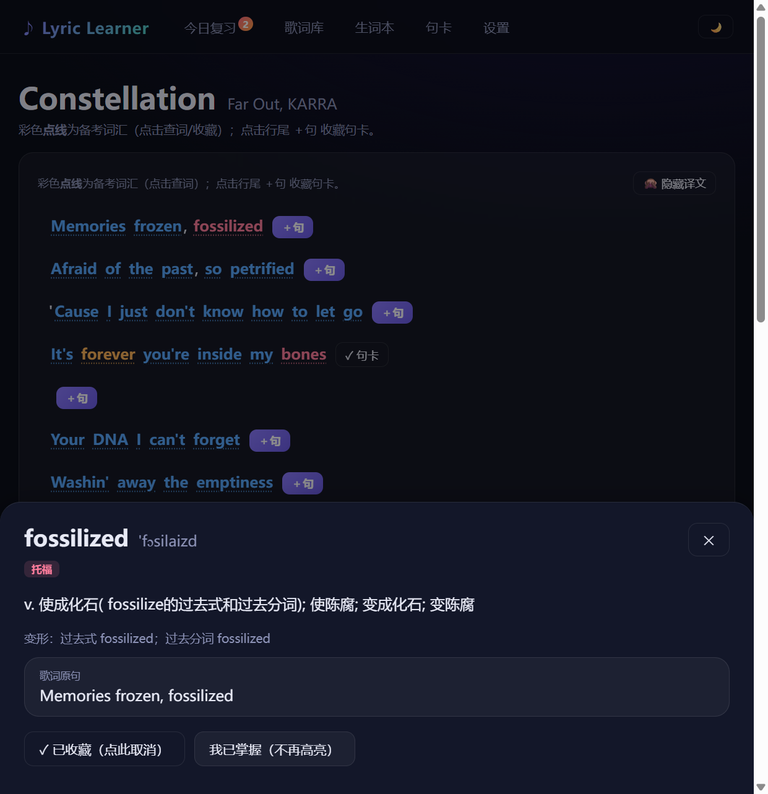

# ♪ Lyric Learner — 用你喜欢的歌词学英语

> 把英文歌变成你的英语教材：AI 逐句标注词汇 · 艾宾浩斯间隔复习 · 歌词挖空默写

Lyric Learner 是一个本地优先的英语学习工具。输入一首你喜欢的英文歌，它会自动抓取歌词、
用 AI（Kimi/Moonshot）生成**考纲分级词汇表、长难句解析、固定搭配、写作仿写**四类学习材料，
并把生词和句卡纳入**艾宾浩斯记忆曲线**的间隔复习队列。

## 📸 演示

**今日复习 —— 歌词挖空默写**



**歌词库 —— 一键搜索导入歌曲**（歌词数据来自 [LRCLIB](https://lrclib.net)，免费无需 Key）



**歌曲详情 —— 备考词汇高亮 + AI 生成的词汇汇总表**



**隐译模式 —— 先自己理解，再对照中文**（右上角一键切换）



**点词查典 —— 音标 / 释义 / 考纲分级 / 一键收藏**



## ✨ 功能

### 学习材料（AI 自动生成）
- 🎯 **考纲分级词汇**：结合 [ECDICT](https://github.com/skywind3000/ECDICT) 词典，按 CET-4 / CET-6 / 考研 / 雅思 / 托福自动分级
- 📖 **长难句解析**：语法结构与中文翻译
- 🔗 **固定搭配**：歌词中的高频词组
- ✍️ **写作仿写**：把歌词句式变成作文模板

### 记忆系统
- 🔄 **三种复习题型**：歌词挖空（填空）、中译英默写（模糊匹配打分）、知识点回顾
- 🧠 **艾宾浩斯间隔重复**：记得 / 模糊 / 不会 三档反馈自动调度下次复习时间
- 📌 **生词本 / 句卡 / 知识点卡** 三类卡片统一管理，支持取消收藏
- 👻 **隐译模式**：隐藏全部中文翻译，逼自己用英文理解（偏好本地记忆）

### 其他
- 🌙 双主题：Midnight 唱片店 / Dashboard 学习仪表盘
- 🔍 歌词在线搜索导入（LRCLIB）或直接粘贴
- 💾 数据全部存本地 SQLite，无账号、无上传

## 🚀 快速开始

> 仓库已包含构建好的前端（`web/dist`），只需 Python 3.10+ 即可运行；
> 修改前端代码时才需要 Node.js 重新构建。

```bash
# 1. 克隆并安装依赖
git clone https://github.com/FAKERSMILE/lyric-learner.git
cd lyric-learner
python -m venv .venv
.venv\Scripts\activate          # Windows
# source .venv/bin/activate     # macOS / Linux
pip install -r requirements.txt

# 2. 准备离线词典（查词与考纲分级用）
#    从 ECDICT 项目 https://github.com/skywind3000/ECDICT 下载 sqlite 数据库，
#    命名为 ecdict.sqlite 放入 data/ 目录（目录不存在请手动创建）

# 3. 启动服务
cd server
python main.py
```

打开 **http://127.0.0.1:8765** ：

1. 进入「歌词库」搜索一首歌并导入（或粘贴歌词）
2. 在「设置」页填入 [Moonshot 开放平台](https://platform.moonshot.cn/) 的 API Key（AI 标注功能需要；查词、复习不依赖 Key）
3. 点击「AI 分析」生成学习材料，点词收藏，等第二天开始复习 🎉

## 🏗 项目结构

```
lyric-learner/
├── server/               # FastAPI 后端
│   ├── main.py           # API 路由 + 静态托管前端
│   ├── db.py             # SQLite 数据层（生词本/句卡/复习计划）
│   ├── lyrics_fetch.py   # LRCLIB 歌词搜索与解析（LRC → 纯文本）
│   ├── vocab_filter.py   # ECDICT 查词 + 考纲分级
│   └── kimi_client.py    # Kimi/Moonshot API 封装（AI 标注）
├── web/                  # Vue 3 + Vite 前端
│   ├── src/views/        # 今日复习 / 歌词库 / 生词本 / 句卡 / 设置
│   ├── src/components/   # 点词抽屉 WordDrawer
│   └── dist/             # 构建产物（已提交，可直接运行）
└── data/                 # 运行时数据（不入库）：app.sqlite / ecdict.sqlite
```

## 🔧 技术栈

| 层 | 技术 |
|---|---|
| 后端 | Python · FastAPI · Uvicorn · SQLite |
| AI | Kimi (Moonshot) OpenAI 兼容 SDK |
| 前端 | Vue 3 `<script setup>` · Vite · Vue Router · 原生 CSS（双主题变量） |
| 数据 | LRCLIB 歌词 API · ECDICT 离线词典 |

## 🗺 Roadmap

- [ ] 复习统计面板（打卡日历 / 词汇量曲线）
- [ ] Anki 词卡导出
- [ ] 单词发音（Web Speech API）
- [ ] Docker 一键部署

## License

[MIT](LICENSE)
